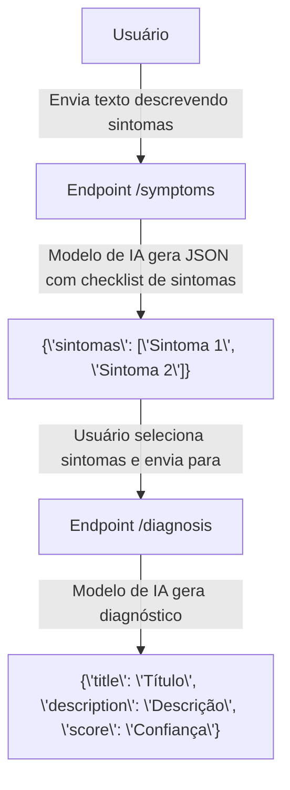
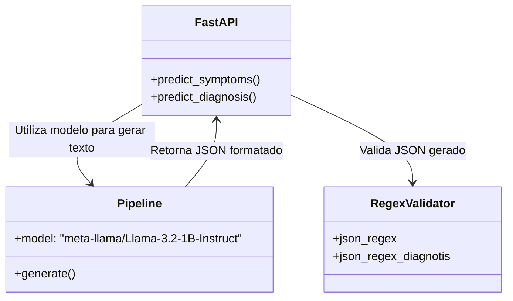

# Expert Doctor API

Este repositório contém o código-fonte da **Expert Doctor API**, um sistema desenvolvido utilizando **FastAPI** que utiliza modelos de linguagem avançados (baseados no Transformers) para auxiliar no diagnóstico médico e na identificação de sintomas. Este projeto foi desenvolvido como parte de um Trabalho de Conclusão de Curso (TCC) e busca demonstrar a aplicação de Inteligência Artificial na área da saúde.

## 📋 Funcionalidades

1. **Identificação de Sintomas** (`/symptoms`):
   - A API recebe uma descrição textual do paciente (em linguagem natural) e gera um checklist de sintomas identificados.
   - Resposta no formato JSON.

2. **Diagnóstico Baseado em Sintomas** (`/diagnosis`):
   - A API recebe um checklist de sintomas e retorna um diagnóstico preliminar em formato JSON contendo:
     - **Título do diagnóstico**.
     - **Descrição do diagnóstico**.
     - **Score de confiabilidade**.

## 🛠️ Tecnologias Utilizadas

- **Python**: Linguagem principal do projeto.
- **FastAPI**: Framework para construção da API.
- **Transformers**: Biblioteca utilizada para integração com modelos de linguagem (Hugging Face).
- **Regex**: Para validação da estrutura de JSON gerado.
- **Pydantic**: Para validação e tipagem de dados.

## 🚀 Fluxo de Funcionamento



## 📄 Exemplos de Uso

### 1. Endpoint `/symptoms`
**Requisição**:
```json
POST /symptoms
Content-Type: application/json

{
    "text": "Estou com febre, dor de cabeça e cansaço."
}
```

**Resposta**:
```json
{
    "sintomas": ["Febre", "Dor de cabeça", "Cansaço"]
}
```

---

### 2. Endpoint `/diagnosis`
**Requisição**:
```json
POST /diagnosis
Content-Type: application/json

{
    "sintomas": ["Febre", "Dor de cabeça", "Cansaço"]
}
```

**Resposta**:
```json
{
    "title": "Gripe",
    "description": "Uma infecção viral comum que afeta o sistema respiratório.",
    "score": "95%"
}
```

## 🎯 Objetivo do Projeto

Este projeto tem como objetivo demonstrar como a Inteligência Artificial pode ser aplicada para:
- Auxiliar no diagnóstico médico preliminar.
- Agilizar processos na área de saúde.
- Aumentar a acessibilidade a informações médicas confiáveis.

## ⚠️ Aviso Legal

**Este sistema não substitui o diagnóstico médico profissional.** Ele é uma ferramenta de suporte e deve ser utilizado apenas como referência inicial. Sempre consulte um médico para um diagnóstico preciso e tratamento adequado.

---

## 📚 Estrutura do Código

- `app.py`: Contém a implementação principal da API.
- **Endpoints**:
  - `/symptoms`: Recebe descrições textuais e gera um checklist de sintomas.
  - `/diagnosis`: Recebe um checklist de sintomas e retorna um diagnóstico.

---

## 🖼️ Diagrama de Componentes Internos



## 💻 Como Executar Localmente

1. Clone este repositório:
   ```bash
   git clone https://github.com/gohealthnow/expert-doctor.git
   cd expert-doctor
   ```

2. Instale as dependências:
   ```bash
   pip install -r requirements.txt
   ```

3. Execute o servidor:
   ```bash
   uvicorn app:app --reload
   ```

4. Acesse a documentação interativa da API em [http://127.0.0.1:8000/docs](http://127.0.0.1:8000/docs).

---

## 📬 Contato

Para mais informações, entre em contato:
- **Autor**: Polabiel
- **E-mail**: bielgabrieloliveira77@gmail.com
